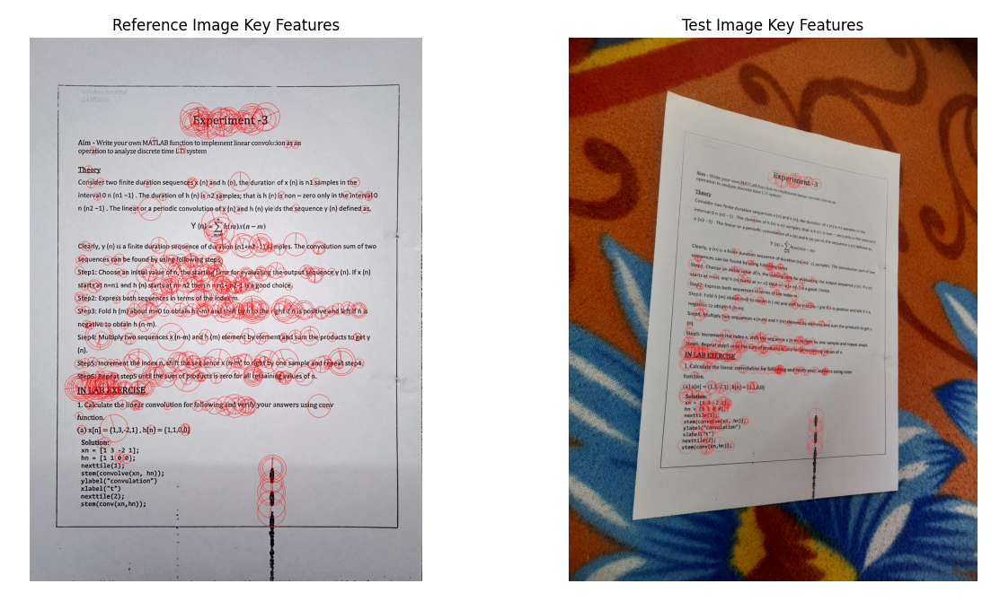
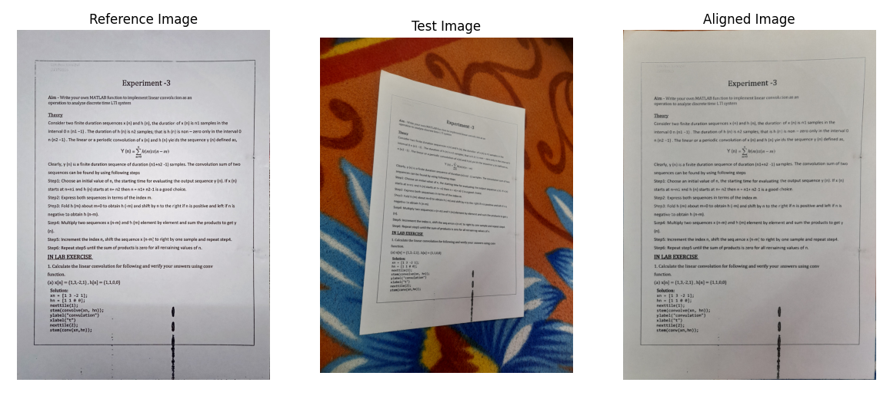
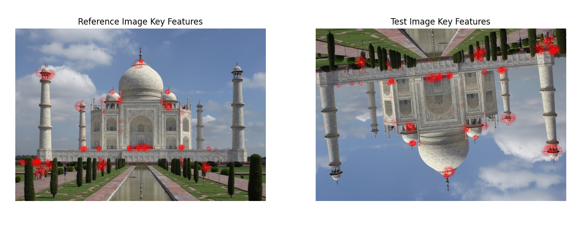
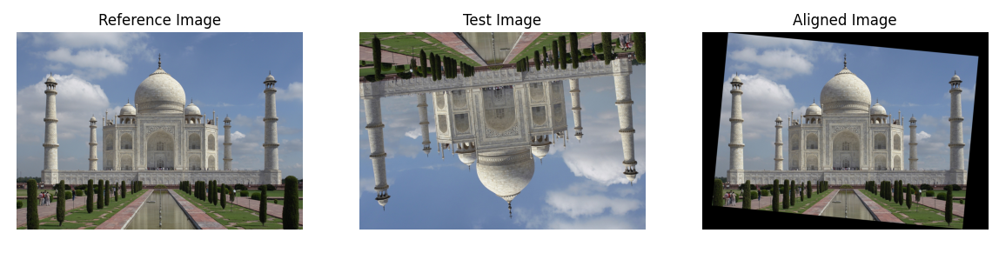

# Image Alignment using ORB Features

This Python script aligns two images using ORB (Oriented FAST and Rotated BRIEF) features and homography transformation. It is useful for tasks such as image stitching and registration.

## Usage

1. Clone the repository:
    ```bash
    git clone https://github.com/HiLakshya/ImageAlignment-OPENCV.git
    ```

2. Navigate to the repository directory:
    ```bash
    cd ImageAlignment-OPENCV
    ```

3. Run the script:
    ```bash
    python image_alignment.py
    ```

## Example 1

### Images Key Features


### Images Alignment


## Example 2

### Images Key Features


### Images Alignment



## Requirements

- Python 3.12.1
- OpenCV (`cv2`)
- NumPy
- Matplotlib

## Google Colab Notebook

Explore the image alignment process interactively using Google Colab. Click the link below to access the notebook:

[](https://colab.research.google.com/drive/1noDZx6yapFwTinHfr_odXGC-NjOtk6Se?usp=sharing)

Note: Make sure to upload your reference and test images directly within the Colab notebook environment.

## References

- [FreeCodeCamp](https://www.freecodecamp.org/)

- [OpenCV University](https://opencv.org/university/)
